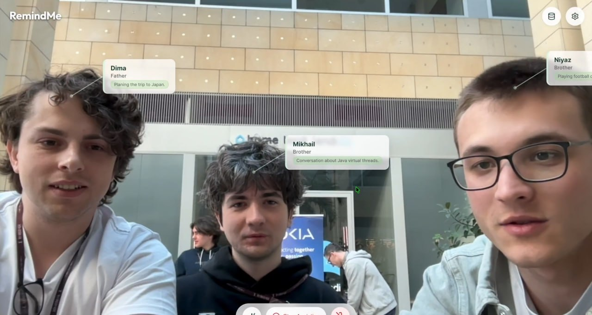
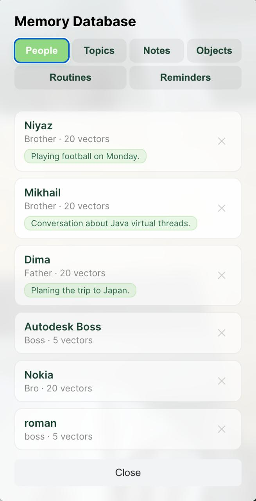
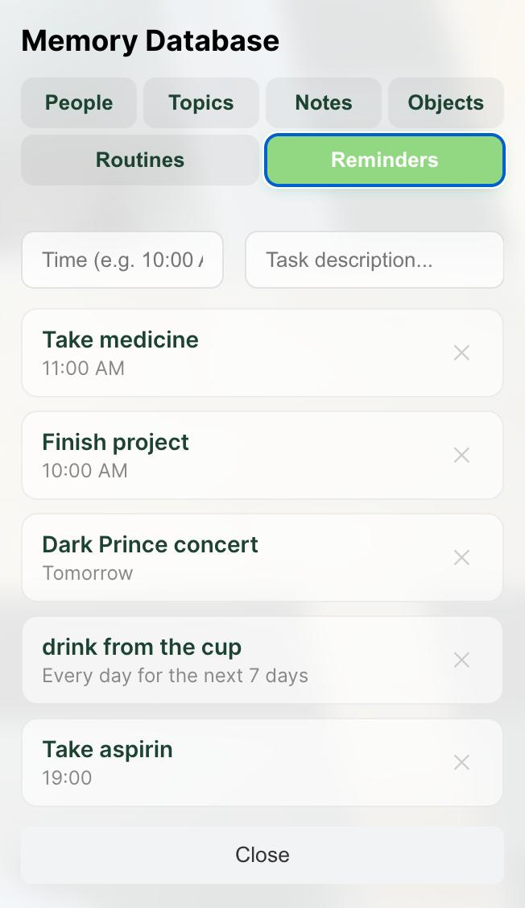

# RemindMe: AI Memory Companion

<p align="center">
  
  &nbsp;&nbsp;
</p>
<p align="center">
  
  
</p>

RemindMe is an ambient AI memory companion designed for smart glasses that supports people with Alzheimer's and cognitive decline. It watches, listens, and remembers — activating only when the user says **"Remind me."**

---

## The Problem

Over 55 million people worldwide live with dementia. They forget faces of loved ones, misplace critical medications, and lose track of daily routines. Every existing assistive tool demands active effort — opening apps, typing, navigating menus — which is exactly what these individuals struggle with.

## What It Does

RemindMe runs passively on smart glasses (or any webcam device) in two modes:

**Ambient Mode** — always on, invisible:
- Recognizes faces and shows names + last conversation topic
- Detects registered personal objects with metadata overlays (name, dosage, schedule)
- Logs environmental context every 30 seconds
- Listens for the "Remind me" hotword offline

**Command Mode** — triggered by voice:
- User speaks naturally: *"Remember this is my blood pressure medication, I take it every morning"*
- System registers objects, adds notes, sets reminders, or retrieves memories
- Responds with natural speech via text-to-speech
- Returns to Ambient Mode automatically

---

## Key Features

- **Face Recognition** — DeepFace + Facenet512 with 512-dim embeddings, top-5 majority voting, and continuous learning (up to 20 vectors per person)
- **Voice Identification** — SpeechBrain ECAPA-TDNN with 192-dim voice prints, identifies speakers without seeing their face
- **Object Recognition** — YOLOv11 detection + DINOv2 384-dim embeddings for personal object matching with metadata overlays
- **Offline Hotword Detection** — Faster-Whisper (small, int8) runs locally, no cloud listening
- **Audio-to-Action LLM** — Raw audio + camera frame sent natively to Gemini Flash for multimodal understanding with structured JSON output
- **Persistent Memory** — ChromaDB vector collections for faces, voices, objects, and session memories + JSON store for notes, reminders, routines
- **Conversation Tracking** — Local Gemma 3 1B extracts topics per person so the user remembers what they last discussed
- **Privacy First** — Hotword detection, topic extraction, and all embeddings run locally. Only explicit commands reach the cloud LLM.
- **Accessible UI** — High-contrast React interface with green face overlays, blue object overlays, and a glow animation synced to microphone volume

---

## Architecture

```
Smart Glasses / Webcam
        │
        ▼
  React Frontend ──WebSocket──▶ FastAPI Backend ──▶ ChromaDB
   (Vite, React 19)              (Python 3.12+)     (Vector DB)
                                      │
                          ┌───────────┼───────────┐
                          ▼           ▼           ▼
                      DeepFace    YOLOv11     Whisper
                      ECAPA-TDNN  DINOv2      Gemini
                      Gemma 3     Edge-TTS
```

### Frontend
- **React 19 + Vite** with WebSocket streaming
- `react-webcam` for camera capture, `lucide-react` for icons
- Web Audio API (`AudioContext` + `AnalyserNode`) for FFT-driven glow animation
- `MediaRecorder` API for WebM audio capture

### Backend
- **FastAPI + Uvicorn** with async WebSocket handlers
- Independent processing loops: face detection (1.5s), object scanning (5s), audio chunks (2.5s), context summaries (30s)
- Structured Pydantic schemas for LLM output
- `google-genai` SDK for Gemini multimodal inference

### Storage
- **ChromaDB** — 4 vector collections: `faces` (512-dim), `voices` (192-dim), `objects` (384-dim), `memories` (text)
- **patient_context.json** — notes, reminders, routines, object metadata, conversation topics

---

## ML Models

| Component | Model | Dimensions | Threshold | Purpose |
|---|---|---|---|---|
| Face Detection | DeepFace + MTCNN | — | 50px min face | Detect faces in frames |
| Face Embedding | Facenet512 | 512-dim | 0.40 cosine | Identify known people |
| Voice Embedding | ECAPA-TDNN (SpeechBrain) | 192-dim | 0.25 cosine | Identify speakers |
| Hotword Detection | Faster-Whisper (small, int8) | — | substring match | Detect "remind me" offline |
| Object Detection | YOLOv11 | — | 0.1 confidence | Detect objects in frames |
| Object Embedding | DINOv2-Small (Meta) | 384-dim | 0.30 cosine | Match personal objects |
| Command Processing | Gemini 3.1 Flash-Lite | — | structured JSON | Understand audio + vision |
| Topic Extraction | Gemma 3 1B | — | — | Extract conversation topics locally |
| Text-to-Speech | Edge-TTS (Azure) | — | — | Spoken responses |

---

## Application Flow

1. **Ambient Mode** — Frontend captures 960×540 frames every 1.5s + 2.5s audio chunks, streams over WebSocket
2. **Face Loop** — DeepFace extracts embeddings → ChromaDB top-5 query → majority voting → green overlay with name
3. **Object Loop** — YOLO detects objects every ~5s → DINOv2 embeddings → ChromaDB match → blue overlay with metadata
4. **Context Loop** — Every 30s, Gemini summarizes the current environment → stored in session memory
5. **Hotword Trigger** — Whisper detects "remind me" → backend sends `STATE_CHANGE` → frontend enters Command Mode
6. **Command Mode** — Continuous audio recording, glow animation synced to voice, YOLO preview of central object
7. **Execution** — User taps screen → raw audio + frame sent to Gemini → structured action returned (add_note, set_reminder, recognize_object, retrieve_memory, respond)
8. **Object Registration** — If action is `recognize_object`: crop → 5 augmented DINOv2 embeddings → ChromaDB + metadata saved
9. **Response** — Gemini's text response converted to speech via Edge-TTS → played back → return to Ambient Mode

---

## Getting Started

### Requirements
- Python 3.12+
- Node.js 22+
- [uv](https://docs.astral.sh/uv/) (Python package manager)
- Gemini API Key

### Local Development

**Terminal 1 — Backend:**
```bash
cd backend
echo "GEMINI_API_KEY=your-api-key" > .env
uv run fastapi dev
```

**Terminal 2 — Frontend:**
```bash
cd frontend
npm install
npm run dev
```

Open `http://localhost:5173` and allow camera + microphone access.

### Docker Compose

**Production:**
```bash
docker compose up --build
```
Frontend on port `80`, backend on port `8000`.

**Development (hot-reload):**
```bash
docker compose -f docker-compose.dev.yml up --build
```
Frontend on port `5173`, backend on port `8000`.

### Environment Variables

Create `backend/.env`:
```
GEMINI_API_KEY=your-gemini-api-key
```

---

## Project Structure

```
remind-me/
├── backend/
│   ├── main.py                 # FastAPI WebSocket server & mode orchestration
│   ├── llm_orchestrator.py     # Gemini command processing & context injection
│   ├── face_processor.py       # DeepFace + Facenet512 + ChromaDB face pipeline
│   ├── voice_processor.py      # ECAPA-TDNN voice identification
│   ├── object_processor.py     # YOLO + DINOv2 object detection & registration
│   ├── audio_processor.py      # Faster-Whisper hotword detection
│   ├── db.py                   # ChromaDB vector database management
│   ├── patient_context.json    # Persistent notes, reminders, routines, objects
│   ├── chroma_data/            # ChromaDB persistent storage
│   └── pretrained_models/      # SpeechBrain ECAPA-TDNN weights
├── frontend/
│   ├── src/
│   │   ├── App.jsx             # Main app — webcam, WebSocket, mode switching
│   │   └── components/
│   │       ├── CommandBar.jsx  # Command mode UI + glow animation
│   │       └── DatabasePanel.jsx # CRUD panel for people, objects, notes, reminders
│   └── public/
├── docker-compose.yml          # Production deployment
├── docker-compose.dev.yml      # Development with hot-reload
└── readme.md
```

---

## Tech Stack

**Frontend:** React 19 · Vite · WebSocket · Web Audio API · react-webcam · lucide-react

**Backend:** FastAPI · Uvicorn · google-genai · DeepFace · SpeechBrain · Faster-Whisper · Ultralytics (YOLO) · Transformers (DINOv2, Gemma 3) · ChromaDB · Edge-TTS · OpenCV · Pydantic

**Infrastructure:** Docker · Docker Compose · Nginx

---

## Future Roadmap

- **Pretrained personal models** — each patient gets a profile pre-loaded with their specific objects by a caregiver
- **Multi-angle object registration** — upload multiple photos for stronger embeddings
- **Voice queries about visible objects** — "What medication is this?"
- **Safety mode** — detect disorientation, trigger GPS sharing + caregiver alerts
- **Full offline operation** — edge inference without internet
- **OCR & barcode scanning** — read labels and expiration dates
- **Caregiver dashboard** — remote monitoring and multi-user management